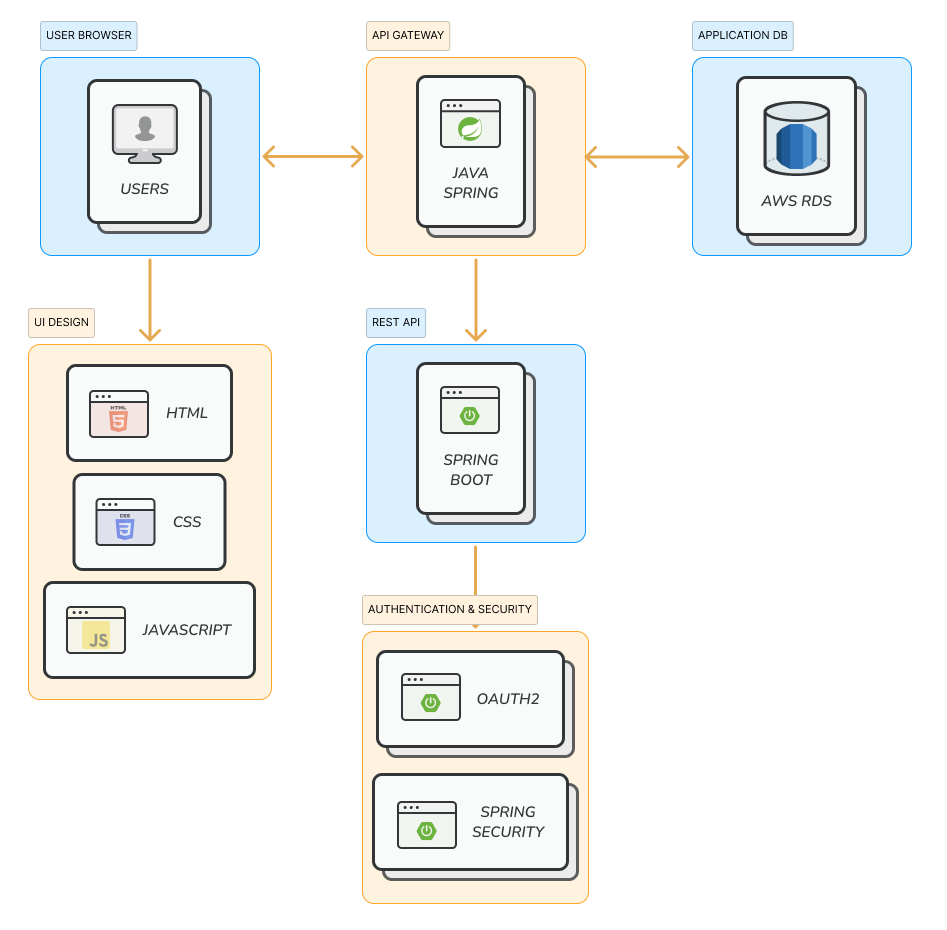
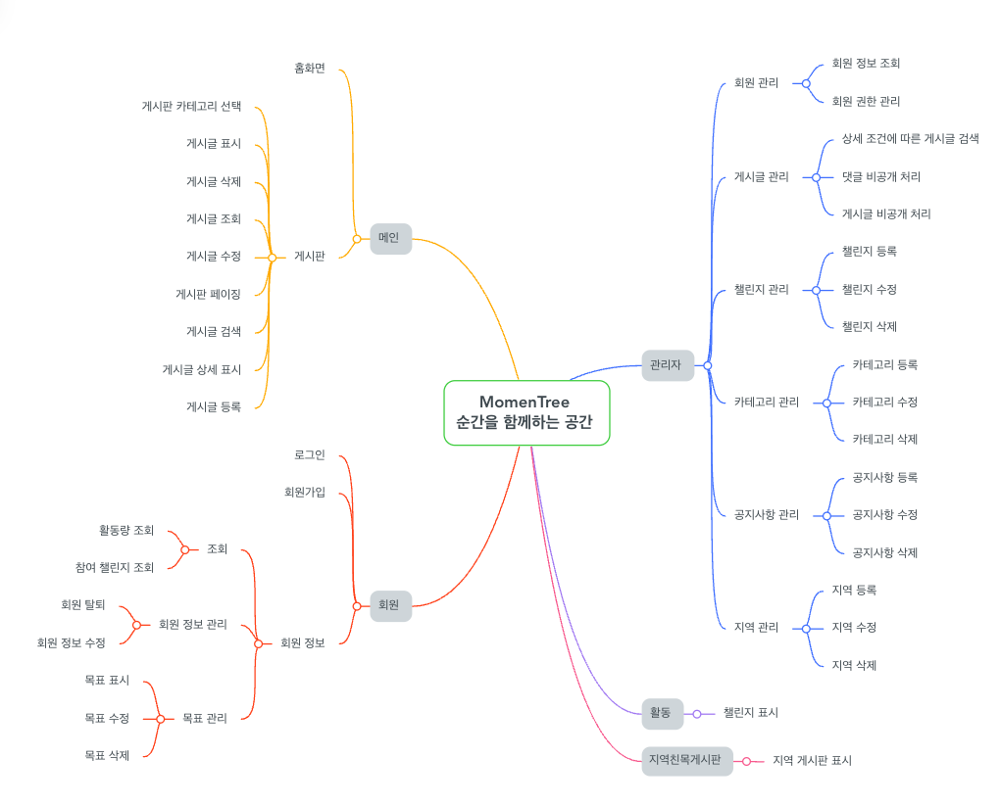
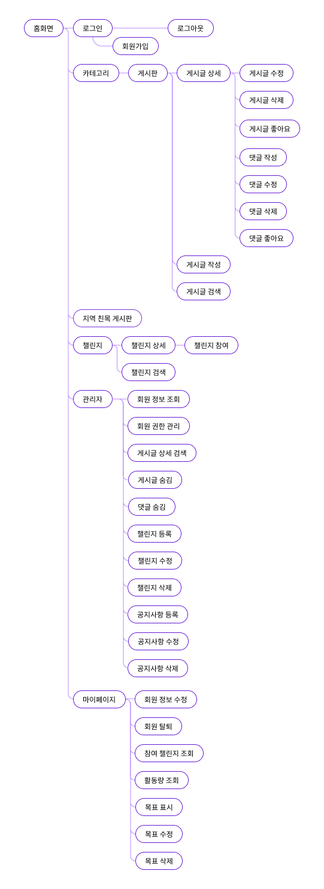
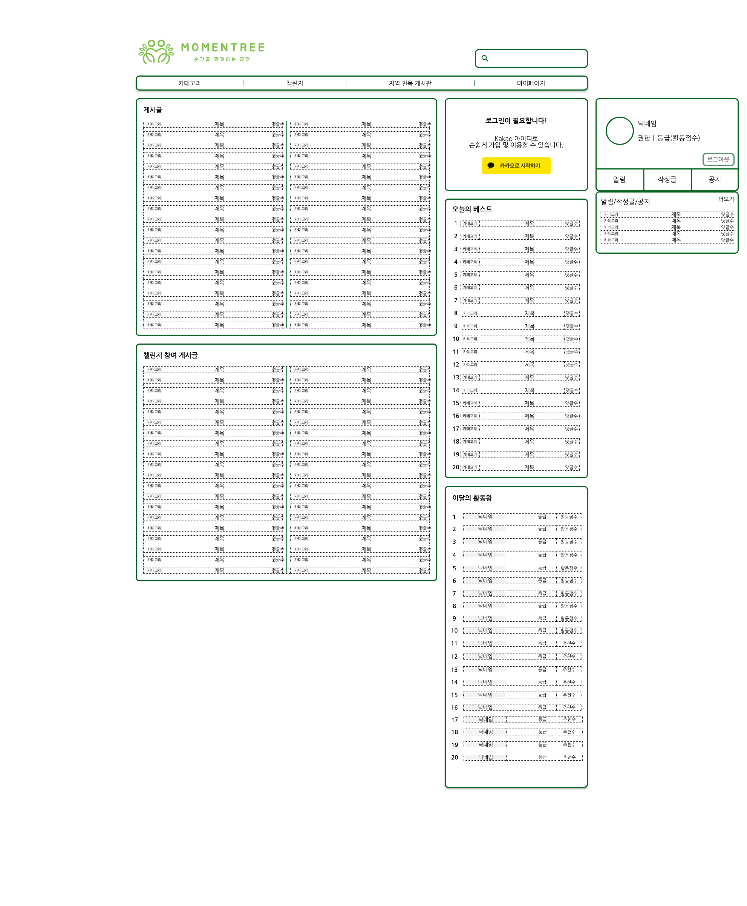
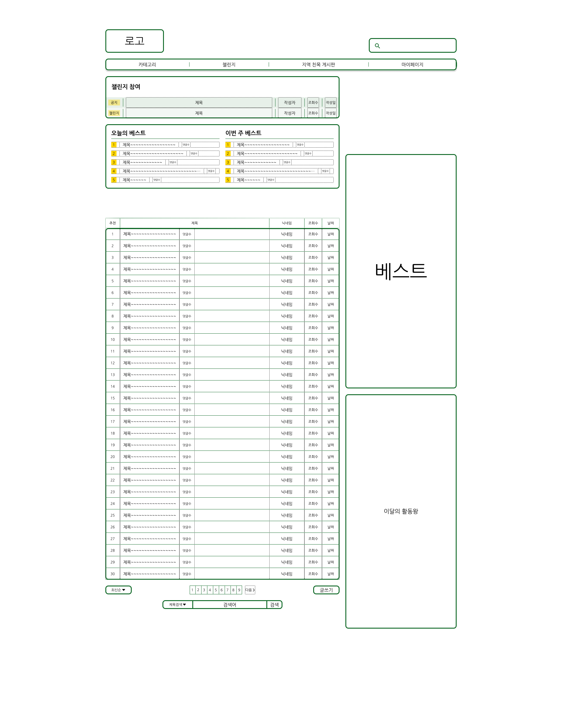
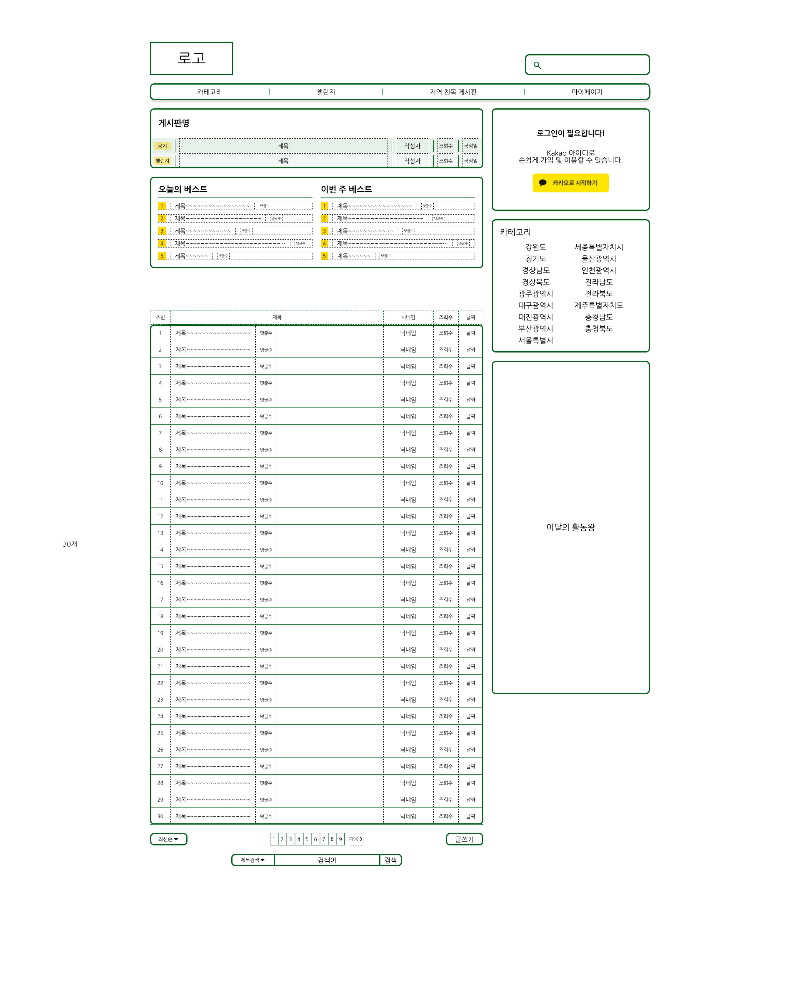
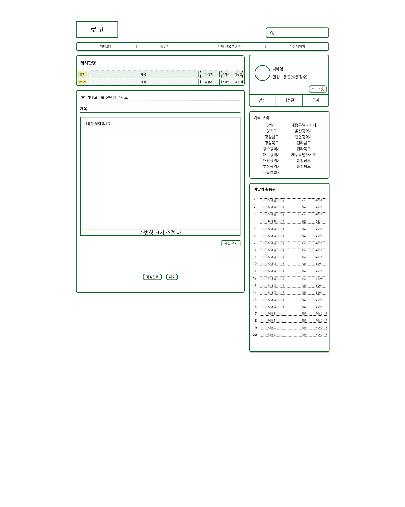
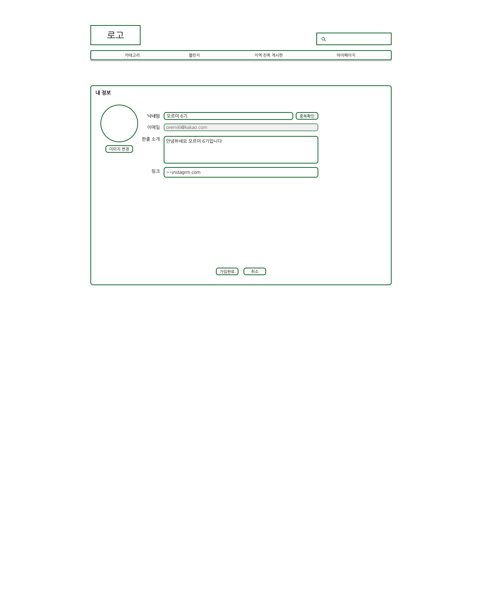
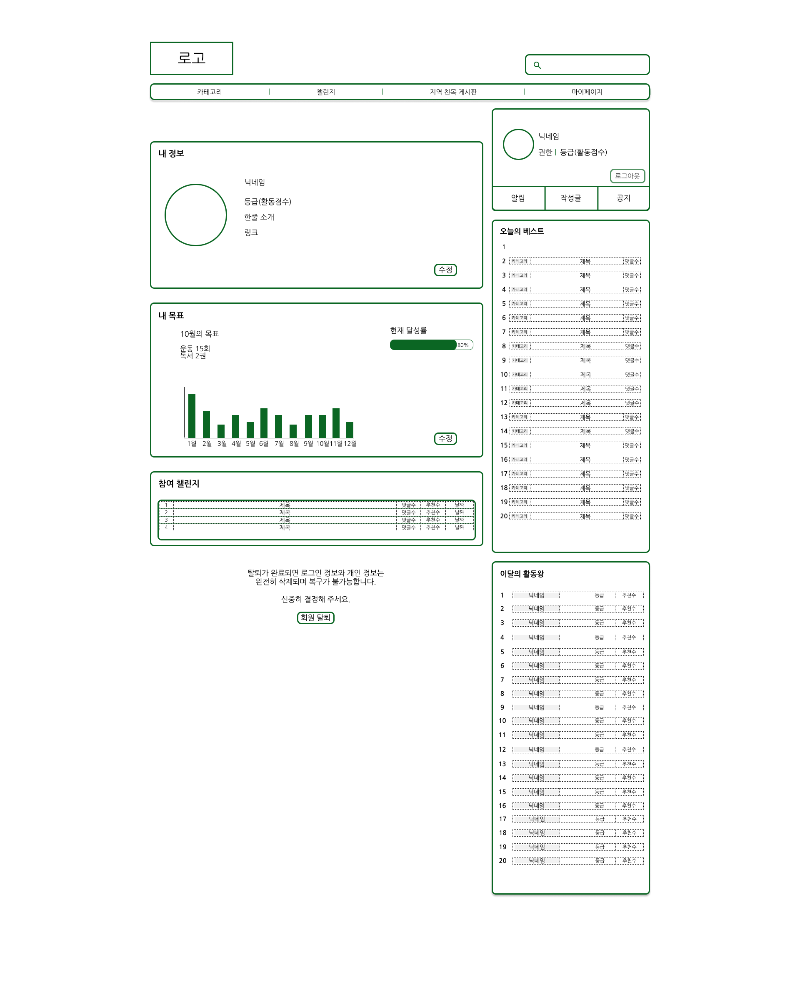
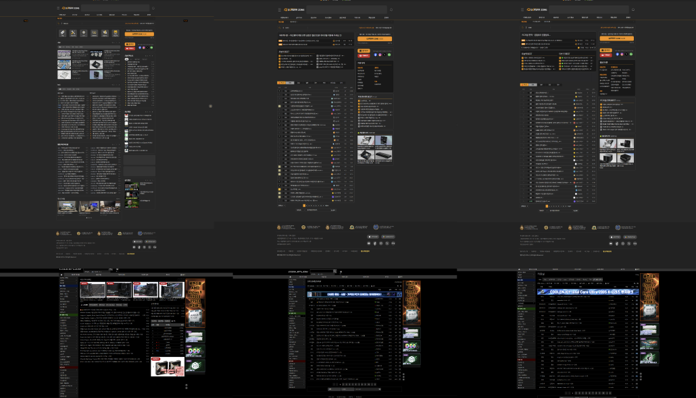

# 다양한 관심사를 가진 사람들의 취미 공유 커뮤니티

 

## 🚀 1. 목표와 기능

### 1.1 목표

- **많은 사람들이 서로의 관심사를 공유하고 소통할 수 있는 커뮤니티 프로젝트**
- **취미 공유를 통해 다른 사람들의 도움과 조언 등을 받음**
- **커뮤니티 활동을 통해 활동 점수를 얻고, 순위에 따라 뱃지를 획득함으로써 성취감 획득**
- **챌린지 게시판을 통해 다양한 취미를 시도하고, 참여를 통해 수식어를 획득하여 참여를 유도**

### 1.2 기능

* 사용방법
    1. 카카오 로그인을 해주세요
    2. 관심사에 따라 게시판에 들어가주세요
    3. 게시글을 작성하시거나 게시글에 댓글을 작성하실 수 있습니다
    4. 또한 챌린지 게시판에서 그에 해당하는 챌린지에 참여하실 수 있습니다

### 1.3 기존 커뮤니티와의 차별성

* 활동량 시스템을 통해 뱃지를 부여하여 활동을 유도
* 챌린지 게시판을 통해 다양한 취미를 시도하고, 참여를 통해 수식어를 획득하여 참여를 유도
* 특정 등급 이상부터 지역 게시판에 접근하여 지역별 취미를 공유하고 소통

 

## 🔗 2. 개발 환경 및 배포 URL

### 2.1 개발 환경

- **Web Framework**: `Spring Boot`
- **DB**: `AWS RDS` (MySQL)
- **Backend**: `Spring Boot` + `REST API`
- **Server**: `AWS EC2`
- **FrontEnd**: CSS + JavaScript + HTML
- **Auth**: `OAuth2`, `Spring Security`
- **IDE**: IntelliJ

### 2.2 아키텍처 설계도

### 2.3 서비스 URL 정보

- 실행 URL:
- GitHub 레포: https://github.com/ESTsoft-Back-end-6th-2nd-project-team3/ESTsoft-2nd-Project

 

## 📅 3. 프로젝트 관리와 개발 일정

### 3.1 팀 구성

- **팀장**: 황승현
- **팀원**: 언형민, 이슬기, 전지현

### 3.2 WBS

- [Notion 타임라인](https://oreumi.notion.site/bc0f904de9ed4905b44b47815fb61ad7?v=0fec363373844f20a44ff85d287a77ee)

 

## 📓 4. 요구사항 명세와 기능 명세

### 4.1 요구사항 명세

 

## ️ 📁 5. 프로젝트 구조

### 5.1 프로젝트 구조

  
📂 ESTsoft-2st-Project

┣ 📂 .gradle 
┣ 📂 .idea 
┣ 📂 build 
┣ 📂 gradle 
┣ 📂 src 
┃ ┣ 📂 main 
┃ ┃ ┣ 📂 java 
┃ ┃ ┃ ┣ 📂 com.estsoft.estsoft2ndproject 
┃ ┃ ┃ ┃ ┣ 📂 config 
┃ ┃ ┃ ┃ ┃ ┣ 📜 JasyptConfigAES 
┃ ┃ ┃ ┃ ┃ ┣ 📜 WebSecurityConfig 
┃ ┃ ┃ ┃ ┣ 📂 controller 
┃ ┃ ┃ ┃ ┃ ┣ 📂 api 
┃ ┃ ┃ ┃ ┃ ┃ ┣ 📜 AdminController 
┃ ┃ ┃ ┃ ┃ ┃ ┣ 📜 CommentApiController 
┃ ┃ ┃ ┃ ┃ ┃ ┣ 📜 MyPageController 
┃ ┃ ┃ ┃ ┃ ┃ ┣ 📜 PostApiController 
┃ ┃ ┃ ┃ ┃ ┃ ┗ 📜 UserController 
┃ ┃ ┃ ┃ ┃ ┣ 📂 main 
┃ ┃ ┃ ┃ ┃ ┃ ┣ 📜 CustomErrorController 
┃ ┃ ┃ ┃ ┃ ┃ ┣ 📜 PageController 
┃ ┃ ┃ ┃ ┃ ┃ ┗ 📜 PostController 
┃ ┃ ┃ ┃ ┣ 📂 customException 
┃ ┃ ┃ ┃ ┃ ┣ 📜 AdditionalInformationRequireException 
┃ ┃ ┃ ┃ ┣ 📂 domain 
┃ ┃ ┃ ┃ ┃ ┣ 📂 dto 
┃ ┃ ┃ ┃ ┃ ┃ ┣ 📂 admin 
┃ ┃ ┃ ┃ ┃ ┃ ┃ ┣ 📜 PostListResponse 
┃ ┃ ┃ ┃ ┃ ┃ ┃ ┗ 📜 UserLevelRequest 
┃ ┃ ┃ ┃ ┃ ┃ ┣ 📂 comment 
┃ ┃ ┃ ┃ ┃ ┃ ┃ ┣ 📜 CommentListResponseDTO 
┃ ┃ ┃ ┃ ┃ ┃ ┃ ┣ 📜 CommentRequestDTO 
┃ ┃ ┃ ┃ ┃ ┃ ┃ ┗ 📜 CommentResponseDTO 
┃ ┃ ┃ ┃ ┃ ┃ ┣ 📂 mypage 
┃ ┃ ┃ ┃ ┃ ┃ ┃ ┣ 📜 ObjectiveRequestDTO 
┃ ┃ ┃ ┃ ┃ ┃ ┃ ┣ 📜 PostResponseDTO 
┃ ┃ ┃ ┃ ┃ ┃ ┃ ┗ 📜 UserInfoResponseDTO 
┃ ┃ ┃ ┃ ┃ ┃ ┣ 📂 post 
┃ ┃ ┃ ┃ ┃ ┃ ┃ ┣ 📜 LikeRequestDTO 
┃ ┃ ┃ ┃ ┃ ┃ ┃ ┣ 📜 PostRequestDTO 
┃ ┃ ┃ ┃ ┃ ┃ ┃ ┗ 📜 PostResponseDTO 
┃ ┃ ┃ ┃ ┃ ┃ ┗ 📂 user 
┃ ┃ ┃ ┃ ┃ ┃ ┃ ┣ 📜 CustomUserDetails 
┃ ┃ ┃ ┃ ┃ ┃ ┃ ┣ 📜 RegisterRequestDTO 
┃ ┃ ┃ ┃ ┃ ┃ ┃ ┗ 📜 UserRequestDTO 
┃ ┃ ┃ ┃ ┃ ┣ 📜 ActivityScore 
┃ ┃ ┃ ┃ ┃ ┣ 📜 Category 
┃ ┃ ┃ ┃ ┃ ┣ 📜 Comment 
┃ ┃ ┃ ┃ ┃ ┣ 📜 Level 
┃ ┃ ┃ ┃ ┃ ┣ 📜 Likes 
┃ ┃ ┃ ┃ ┃ ┣ 📜 Objective 
┃ ┃ ┃ ┃ ┃ ┣ 📜 Post 
┃ ┃ ┃ ┃ ┃ ┣ 📜 PostType 
┃ ┃ ┃ ┃ ┃ ┣ 📜 Region 
┃ ┃ ┃ ┃ ┃ ┣ 📜 SubMenu 
┃ ┃ ┃ ┃ ┃ ┗ 📜 User 
┃ ┃ ┃ ┃ ┣ 📂 exception 
┃ ┃ ┃ ┃ ┃ ┣ 📜 CustomAccessDeniedHandler 
┃ ┃ ┃ ┃ ┃ ┣ 📜 GlobalExceptionHandler   
┃ ┃ ┃ ┃ ┃ ┣ 📜 PostNotFoundException   
┃ ┃ ┃ ┃ ┃ ┗ 📜 UserNotFoundException  
┃ ┃ ┃ ┃ ┣ 📂 repository 
┃ ┃ ┃ ┃ ┃ ┣ 📜 ActivityScoreRepository 
┃ ┃ ┃ ┃ ┃ ┣ 📜 CategoryRepository 
┃ ┃ ┃ ┃ ┃ ┣ 📜 CommentRepository 
┃ ┃ ┃ ┃ ┃ ┣ 📜 LikesRepository 
┃ ┃ ┃ ┃ ┃ ┣ 📜 ObjectiveRepository 
┃ ┃ ┃ ┃ ┃ ┣ 📜 PostRepository 
┃ ┃ ┃ ┃ ┃ ┣ 📜 RegionRepository 
┃ ┃ ┃ ┃ ┃ ┗ 📜 UserRepository 
┃ ┃ ┃ ┃ ┣ 📂 service 
┃ ┃ ┃ ┃ ┃ ┣ 📜 AdminService 
┃ ┃ ┃ ┃ ┃ ┣ 📜 CommentService 
┃ ┃ ┃ ┃ ┃ ┣ 📜 MyPageService 
┃ ┃ ┃ ┃ ┃ ┣ 📜 ObjectiveService 
┃ ┃ ┃ ┃ ┃ ┣ 📜 PostService 
┃ ┃ ┃ ┃ ┃ ┗ 📜 UserService 
┃ ┃ ┃ ┗ 📜 EsTsoft2ndProjectApplication 
┃ ┃ ┣ 📂 resources 
┃ ┃ ┃ ┣ 📂 sql 
┃ ┃ ┃ ┣ 📂 static 
┃ ┃ ┃ ┃ ┣ 📂 css 
┃ ┃ ┃ ┃ ┃ ┣ 📜 base.css 
┃ ┃ ┃ ┃ ┃ ┗ 📜 reset.css 
┃ ┃ ┃ ┃ ┣ 📂 images 
┃ ┃ ┃ ┃ ┃ ┣ 📜 logo.png 
┃ ┃ ┃ ┃ ┗ 📂 js 
┃ ┃ ┃ ┃ ┃ ┣ 📜 bulletin-board-list.js 
┃ ┃ ┃ ┃ ┃ ┣ 📜 edit-profile.js 
┃ ┃ ┃ ┃ ┃ ┗ 📜 mypage-profile.js 
┃ ┃ ┃ ┗ 📂 templates 
┃ ┃ ┃ ┃ ┣ 📂 fragment 
┃ ┃ ┃ ┃ ┃ ┣ 📜 bulletin-board-list.html 
┃ ┃ ┃ ┃ ┃ ┣ 📜 category.html 
┃ ┃ ┃ ┃ ┃ ┣ 📜 category-best.html 
┃ ┃ ┃ ┃ ┃ ┣ 📜 category-name.html 
┃ ┃ ┃ ┃ ┃ ┣ 📜 edit-objective.html 
┃ ┃ ┃ ┃ ┃ ┣ 📜 edit-profile.html 
┃ ┃ ┃ ┃ ┃ ┣ 📜 my-objective.html 
┃ ┃ ┃ ┃ ┃ ┣ 📜 mypage-profile.html 
┃ ┃ ┃ ┃ ┃ ┣ 📜 participated-challenge.html 
┃ ┃ ┃ ┃ ┃ ┣ 📜 register.html 
┃ ┃ ┃ ┃ ┃ ┣ 📜 search-all.html 
┃ ┃ ┃ ┃ ┃ ┣ 📜 view-comment.html 
┃ ┃ ┃ ┃ ┃ ┣ 📜 view-post.html 
┃ ┃ ┃ ┃ ┃ ┗ 📜 write-post.html 
┃ ┃ ┃ ┃ ┗ 📂 post 
┃ ┃ ┃ ┃ ┃ ┣ 📜 create-post.html 
┃ ┃ ┃ ┃ ┃ ┣ 📜 view-post.html 
┃ ┃ ┃ ┃ ┃ ┣ 📜 view-post-all.html 
┃ ┃ ┃ ┃ ┃ ┣ 📜 view-post-by-category.html 
┃ ┃ ┃ ┃ ┃ ┗ 📜 view-search-results.html 
┃ ┃ ┃ ┃ ┗ 📂 testHtml 
┃ ┃ ┃ ┃ ┃ ┣ 📜 comment-test.html 
┃ ┃ ┃ ┃ ┃ ┣ 📜 login.html 
┃ ┃ ┃ ┃ ┃ ┣ 📜 register.html 
┃ ┃ ┃ ┃ ┃ ┣ 📜 test-index.html 
┃ ┃ ┃ ┃ ┃ ┗ 📜 index.html 
┃ ┃ ┃ ┗ 📜 application.yml 
┗ 📂 test 
┣ 📜 .gitignore 
┣ 📜 build.gradle 
┣ 📜 gradlew 
┣ 📜 README.md 
┣ 📜 settings.gradle 

 

### 5.2 데이터베이스 구조

- [DBDiagram](https://dbdiagram.io/d/6721d847b4216d5a28b12345)

 

  

#### **< 스키마 주요 사항 >**

- **LIKES**
    - `like_type`: 게시글, 댓글 구분
    - `target_id`: 게시글, 댓글 id
- **POST**
    - `post_type`: 카테고리, 지역, 챌린지, 공지사항 구분
    - `category_id`: 카테고리, 지역 id

 

## 🖥️ 6. UI 구성 및 화면 정의서

### 6.1 메뉴 구조도

### 6.1 주요 화면 구성

| 화면 이름     | 화면 이미지                                       | 설명                                                                                                                                                                                                            |
|-----------|----------------------------------------------|---------------------------------------------------------------------------------------------------------------------------------------------------------------------------------------------------------------|
| 메인 화면     |   | - 오늘의 베스트 게시글: 가장 인기 있는 게시글을 표시   - 이달의 활동왕: 활동 점수가 높은 사용자 표시   - 최근 게시글 목록: 최신 게시글을 빠르게 확인   - 챌린지 참여 게시글 목록: 현재 진행 중인 챌린지 관련 게시글 표시                                                                |
| 챌린지 화면    |    | - 카테고리 선택: 사용자가 특정 챌린지 카테고리를 선택할 수 있음   - 오늘의 챌린지 베스트: 오늘 가장 인기 있는 챌린지 게시글   - 이번 주 챌린지 베스트: 이번 주 동안 인기 있는 챌린지 게시글   - 챌린지 게시글 목록: 선택한 챌린지에 대한 모든 게시글 표시   - 챌린지 순위: 해당 챌린지에서 활동 점수가 높은 사용자 순위 표시 |
| 게시판 화면    |    | - 게시판에 해당하는 게시글 목록: 해당 게시판에 포함된 모든 게시글 표시   - 게시판의 베스트 게시글: 인기 있는 게시글 순위로 표시   - 게시판 하위 목록: 특정 주제나 카테고리의 세부 목록                                                                                          |
| 게시글 작성 화면 |  | - 게시글 작성 폼: 사용자가 글 작성 시 텍스트와 이미지를 입력할 수 있는 폼                                                                                                                                                                  |
| 회원 가입 화면  |   | - 사용자 회원가입: 새로운 사용자가 가입할 때 닉네임, 한줄 소개, SNS 링크를 입력할 수 있는 폼                                                                                                                                                     |
| 마이페이지 화면  |  | - 목표를 확인하고 수정: 사용자가 자신의 목표를 설정하거나 수정 가능   - 참여한 챌린지 확인: 사용자가 참여한 챌린지 목록을 확인                                                                                                                                |

 

## 🛠️ 7. 과업 및 기능 구현

### 7.1 주요 과업

- **알림 서비스**: 댓글, 공지사항 등의 알림 기능 제공
- **일반 로그인 및 회원가입**: OAuth2 외 일반 로그인ㆍ회원가입 기능 구현
- **등급 부여 시스템**: 활동 점수에 따른 등급 부여 구체화
- **이미지 삽입 기능**: 게시글 본문에 사진 삽입 기능 지원
- **닉네임 중복 방지**: 회원가입 시 닉네임 중복 검사
- **닉네임 변경 동시성 해결**: 다중 사용자 환경에서 닉네임 변경 시 발생할 수 있는 동시성 문제 해결
- **연속 클릭 방지**: 데이터 전송 시 연속 클릭 방지로 중복 전송 방지

 

## ⚠️ 8. 에러 및 트러블슈팅 히스토리

### 8.1 에러 사례 및 해결 과정

- **Spring Security 로그인 과정 중 Exception 처리 문제**
    - 발생 문제: 로그인 중 발생한 Exception이 `ControllerAdvice`에서 처리되지 않음
    - 해결 방법: Spring Security에서 발생하는 Exception은 `security filter chain`에서 처리해야
      하며, `.oauth2Login(oauth2 -> oauth2.failureHandler())`를 통해 Exception을 처리하도록 수정

- **Spring Security 리다이렉션 이후 CORS 에러**
    - 발생 문제: 리다이렉션 이후 카카오 로그인 진행 시 CORS 에러 발생
    - 해결 방법: 가입 페이지에서 서버로 `form` 데이터를 전송 후 응답을 받고 카카오 로그인 URL로 로그인 요청을 전송하여 해결

- **JavaScript에서 onclick 함수와 Thymeleaf 변수 사용 시 SyntaxError**
    - 발생 문제: `onclick` 함수 내에 Thymeleaf 변수를 사용 시 `SyntaxError` 발생
    - 해결 방법: `onclick`을 `th:onclick`으로 변경하고, `th:onclick="함수명(this.getAttribute('변수명'))"` 형식으로 함수를 호출하여 변수 할당을 적용

 

## 📋 9. 참고 자료

### 9.1 참고 스타일 및 디자인

- **GitHub 블로그 스타일 참조**
    - [GitHub Engineering Blog](https://github.blog/category/engineering/)을 참고하여 UI/UX 디자인과 레이아웃에 반영

### 9.2 타임리프 템플릿 조각

- **Spring MVC - 타임리프(Thymeleaf) 템플릿 조각과 레이아웃**
    - `th:fragment`, `th:insert`, `th:replace` 등을 사용하여 템플릿 구조를 구성하고 레이아웃을 관리

### 9.3 레퍼런스 이미지

| 참고 사이트                                       |
|----------------------------------------------|
|  |

 

## ✒️ 10. 개발하며 느낀점